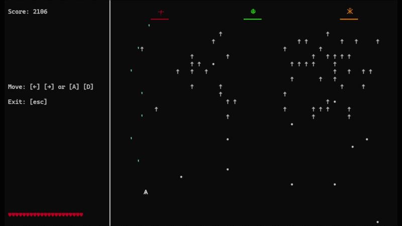

# Terminal Alien Invader 2
This game is inspired by the arcade game called "Space Invaders", released in 1978.

If you just want to play the game, run the exe file in dist/TerminalAlienInvader2.exe



## Bosses
### Red boss - ༒
The strongest boss. 
#### Abilities
- **Teleportation**: Teleports every couple of seconds to a random location on the x and y-axis in front of the player's spaceship.
- **Frenzy mode**: Every couple of seconds, frenzy mode activates, which will make the boss change its color as well as its projectiles rapidly and repeatedly. While in this mode, both its movement speed and firing speed are increased to the maximum possible speed. Its movement pattern changes into an erratic left-and-right movement. Then, it teleports a lot more often than normal. 

### Green boss - ☬
Moves fast but has little damage.

### Orange boss - Ӝ
Moves slow but has high damage.

## Requirements
- **Windows only** — the game reads the keyboard through `msvcrt` and the Windows API.
- Python 3

## How to Run
From the project folder:
```
python main.py
```
or `python -m terminal_alien_invader_2`. If launched from an IDE's built-in terminal, the game opens itself in a new console window.

## Building an exe
The game can be packaged into a single `.exe` that runs without Python installed, using [PyInstaller](https://pyinstaller.org):
```
pip install pyinstaller
python -m PyInstaller --onefile --console --clean --name TerminalAlienInvader2 --specpath build main.py
```
The exe is written to `dist\TerminalAlienInvader2.exe`. Windows SmartScreen may warn about it the first time it is run, since it is not code-signed.

## Controls
| Key | Action |
| --- | --- |
| `A` / `←` | Move left |
| `D` / `→` | Move right |
| `Esc` | Quit |

Your ship fires automatically. When a round ends (GAME OVER or YOU WIN), a new round starts after a short pause.

## Project Structure
```
main.py                  Entry point
terminal_alien_invader_2/
├── config.py            Every fixed setting: colours, sizes, timings, ship stats
├── state.py             GameState: everything that changes during a round
├── game.py              Game loop, update order, starting and ending rounds
├── console.py           Console window setup and drawing primitives
├── controls.py          Keyboard input (Windows only)
├── render.py            Drawing the world and the left display
├── player.py            The player's ship and its shots
├── collision.py         Projectiles hitting ships and barriers
├── effects.py           Explosions and hit flashes
└── enemies/
    ├── ranks.py         Forming up and marching the ranks
    ├── attack.py        Enemy firing and enemy projectiles
    ├── bosses.py        Behaviour shared by all bosses, and their barriers
    └── red_boss.py      The red boss: pace changes, teleports, frenzy mode
```